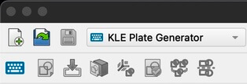
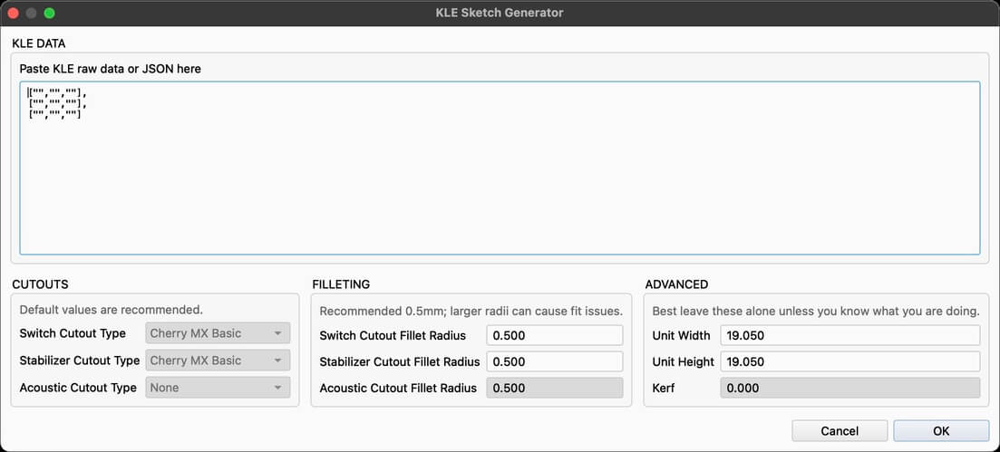

<p align="center">
  
</p>

# KLE Plate Generator

Convert your KeyboardLayoutEditor.com layout to a FreeCAD sketch.

## Key Notes

- This is currently under development and for now works in a very basic manner. Several features can / should be added - but for now I have no time to dedicate to  this. Helpers are welcome.

## How to Install

Clone this repo into your FreeCAD `Mod` folder.

- On Linux it is usually `/home/username/.local/share/FreeCAD/Mod/`
- On Windows it is `%APPDATA%\FreeCAD\Mod\`, which is usually `C:\Users\your_user_name\Appdata\Roaming\FreeCAD\Mod\`
- On macOS it is usually `/Users/username/Library/Application Support/FreeCAD/Mod/`.
- *(You can confirm find the folder by typing `App.getUserAppDataDir()` in the Python console.)*

In that folder type:

```sh
git clone https://github.com/keybo-collective/kle2freecad
```

## How to Use

*(This section will be expanded later, but for now...)*

- Once you restart FreeCAD you should be able to see a Workbench called **KLE Plate Generator**, select this.
- Once the **KLE Plate Generator** Workbench is selected you should see a **KLE Sketch Generator** button.
    
- Pressing this will evoke the generator UI prompting you for your KLE "raw" data.
    
- Output from this screen will be a generated sketch of the plate.

## Current Limits

- Only generates simple Cherry MX Basic key footprints.
- Only generates simple Cherry MX Basic stab cutouts (PCB mount).

## Next?

- Further develop the generator to make other key and stab footprints.
- Further develop the generator with features such as key rotation.
- Add acoustic cutout capabilities.
- Add variable kerf settings.

> When? 🤷‍♂️ .. no time ... so will depend on other's help.

## Support

- None
- ... but if you're good at coding *(or **really good** at driving Ai)* then start with the PR, or ping me on the Atelier discord.
